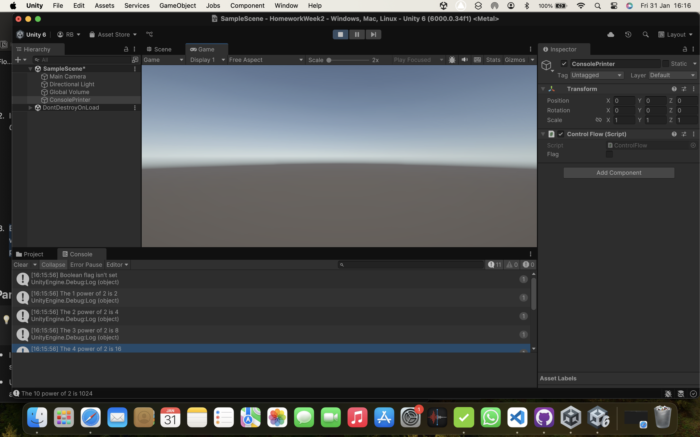

# UnityWeek2
 
Renée Baumann

In this repo I will put a markdown in the main folder labeled UnityWeek2. In that Folder I will have another folder named HomeWorkWeek2 which will have my Unity project and all it's files and folders in it. 

In my root directory is also my .gitignore, which is a hidden file. 

# FlagTrue

# FlagFalse

My favourite soundtrack, I think I can only grasp from very few games as I have never particularly listened to the music. I was more interested in the game. But I like the Last of Us, as that is the game that got me into gaming on the PS5. 

# TheLastOfUs

<https://www.youtube.com/watch?v=Pt1pOY3_W64>